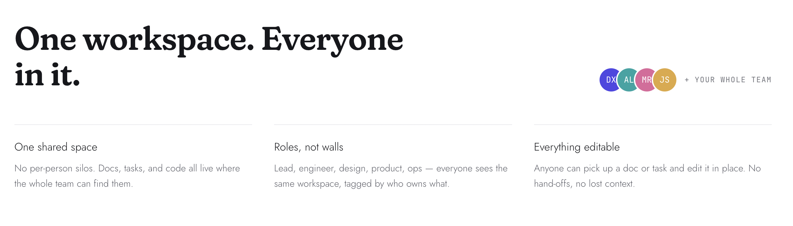

# Dexter's Lab

A simple, free Notion alternative for teams. One shared workspace where your team writes docs, tracks tasks, and keeps the code snippets everyone keeps re-asking for, all in one place.



## What it is

Dexter's Lab is a lightweight team workspace built around three surfaces and a shared team directory:

- **Docs.** Notion-style nested pages with full-page writing, tags, and optional AI drafting.
- **Tasks.** A shared board (To do, In progress, Review, Done) with assignees, priorities, and due dates.
- **Codebase.** A library of code snippets and repository links your teammates keep re-asking for.
- **Team.** A member directory with roles, so everyone sees the same workspace tagged by who owns what.

A dashboard gives the team a live pulse, and settings surface which services are connected.

## Highlights

- Full-page, distraction-free editors for docs, tasks, and snippets that autosave as you type.
- Command palette (Cmd or Ctrl + K) to jump anywhere or start anything.
- Reversible actions everywhere. Every forward step has a quieter back step, and back steps never destroy your data.
- Everything a teammate wrote stays editable in place.
- Optional AI assist (draft a doc, summarize, explain code) that degrades gracefully when no key is set.
- Fully responsive, with a dedicated mobile navigation.

## Tech stack

- Next.js (App Router) and React
- Tailwind CSS v4 (design tokens defined inline in `app/globals.css`)
- TypeScript, strict mode
- HugeIcons for iconography
- Postgres (Neon) for persistence, localStorage as the client-side cache, Upstash Redis for presence

## Getting started

Requirements: Node.js 20 or newer.

```bash
npm install
npm run dev
```

Then open http://localhost:3000 and complete the short onboarding to create your first member.

### Scripts

- `npm run dev` starts the dev server (Turbopack)
- `npm run build` creates a production build
- `npm run start` serves the production build
- `npm run lint` runs ESLint

## Configuration

Copy the template and fill in keys as you go. Everything is optional; features degrade honestly when a key is missing.

```bash
cp .env.example .env.local
```

| Variable | Purpose |
| --- | --- |
| `DEEPSEEK_API_KEY` | Budget AI lane (draft docs, explain code) |
| `ANTHROPIC_API_KEY` | Quality AI lane, preferred when both keys are set |
| `DATABASE_URL` | Postgres — replaces browser storage and syncs the team |
| `GOOGLE_CLIENT_ID`, `GOOGLE_CLIENT_SECRET`, `AUTH_SECRET` | Google team sign-in |
| `SMTP_URL`, `MAIL_FROM` | Invite emails with a sign-in link |
| `GITHUB_CLIENT_ID`, `GITHUB_CLIENT_SECRET` | Higher rate limits for GitHub repo lookups |
| `UPSTASH_REDIS_REST_URL`, `UPSTASH_REDIS_REST_TOKEN` | Presence — who's online right now |

Connected services appear live under Settings, Services.

## Project structure

```
app/            Routes: landing, login, onboarding, and the /app workspace
  api/          Route handlers (assist, status)
  app/          The product: dashboard, docs, tasks, codebase, team, settings
components/     Shell (sidebar, mobile nav, command palette) and UI primitives
lib/            Data types, persistence layer, and service config
```

## Roadmap

- **Phase 1 — live.** Postgres + Google sign-in: one real, synced team workspace with email invites.
- **Phase 2 — live.** GitHub linking: paste a repo URL and real metadata fills in.
- **Phase 3 — live.** Presence: online dots and a live member count via Redis.
- **Next.** Instant-push collaboration (live cursors), richer doc blocks.

## Status

Private beta. With the Phase 1 keys set, all workspace data lives in Postgres and is shared by every signed-in member; the browser keeps only a local cache.
